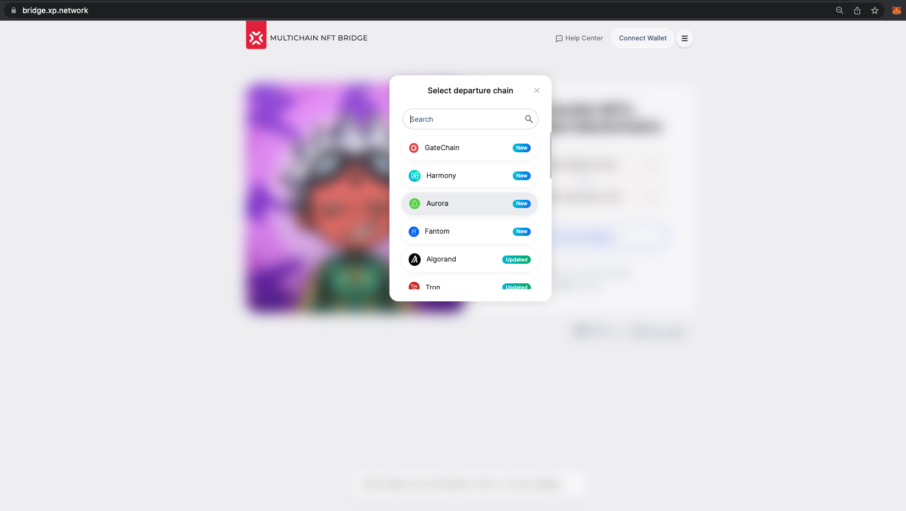
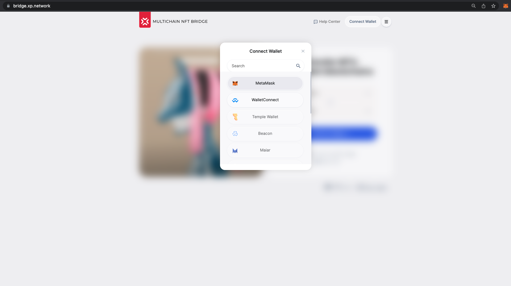
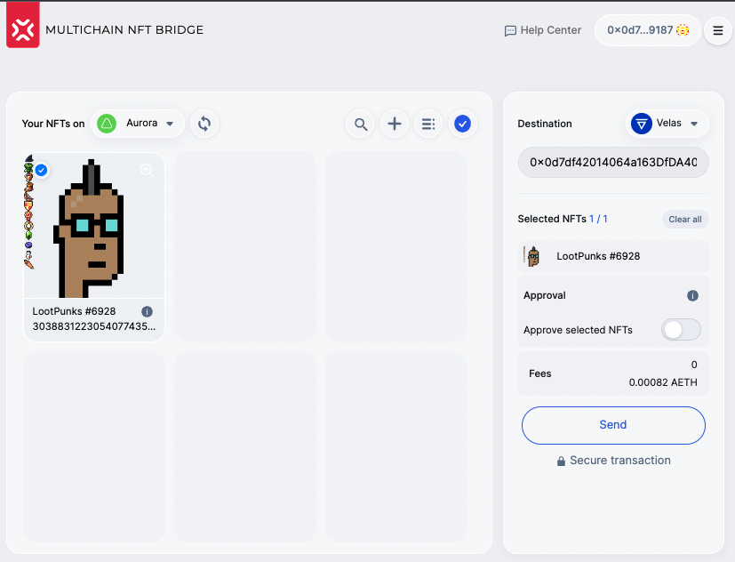
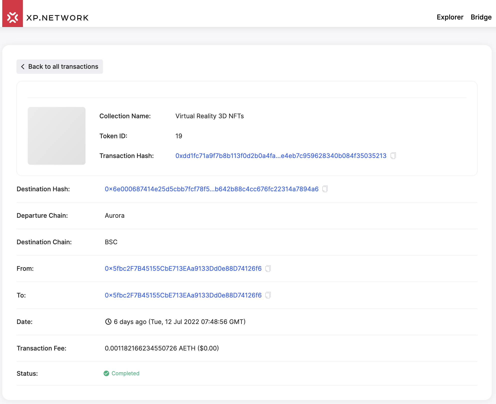
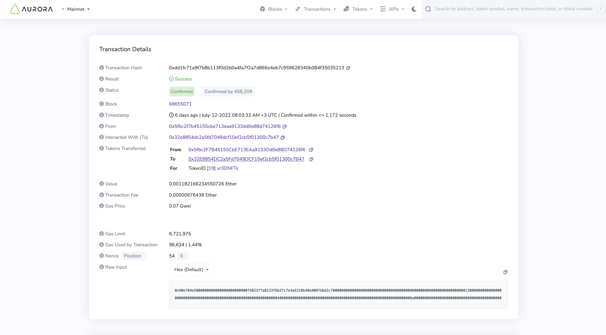
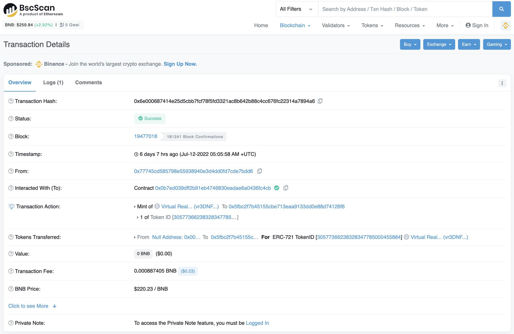
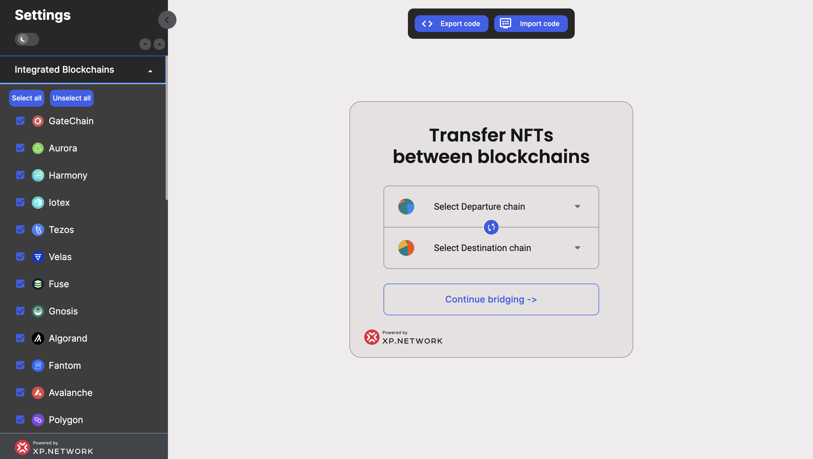

# Aurora Grant Delivery Report

The present report documents integrating Aurora Testnet into XP.network Multi-Chain NFT Bridge.

Aurora is assigned the internal bridge nonce [#21](https://github.com/XP-NETWORK/xpjs/blob/0d6118234d4a9656bba1d9b55a9be38e527ddffb/src/consts.ts#L138):

## Mainnet UI Integration

>
>Aurora added to the UI of the bridge

## Testnet Contracts
| SC Name / Type | Address|
|:-:|:-:|
|UserNftMinter|0x34933A5958378e7141AA2305Cdb5cDf514896035|
|Erc1155Minter|0x9cdda01E00A5A425143F952ee894ff99B5F7999F|
|XPNft|0x8CEe805FE5FA49e81266fcbC27F37D85062c1707|
|Bridge|0x3fe9EfFa80625B8167B2F0d8cF5697F61D77e4a2|

## Mainnet Contracts
| SC Name / Type | Address|
|:-:|:-:|
|XPNft1155|0xca8E2a118d7674080d71762a783b0729AadadD42|
|XPNft|0x041AE550CB0e76a3d048cc2a4017BbCB74756b43|
|Bridge|0x32E8854DC2a5Fd7049DCF10ef2cb5f01300c7B47|

## Wallet Support
>
>Metamask & WalletConnect can be used with Aurora in the bridge

## Milestone Delivery

|#|Milestone|Deliverables|
|:-:|:-:|:-|
|1|Smart contracts|1. [Support ERC-721](https://github.com/XP-NETWORK/XP.network-HECO-Migration/blob/dist/dist/BridgeNFT.d.ts) 2. [Support ERC-1155](https://github.com/XP-NETWORK/XP.network-HECO-Migration/blob/dist/dist/Erc1155Minter.d.ts) 3. [Freeze/Unfreeze Native NFTs](https://github.com/XP-NETWORK/XP.network-HECO-Migration/blob/f474704150da557f931e011026d0c033b391bd7a/dist/Minter.d.ts#L160) 4. [Mint/Burn wrapped NFTs](https://github.com/XP-NETWORK/XP.network-HECO-Migration/blob/f474704150da557f931e011026d0c033b391bd7a/dist/Minter.d.ts#L160) 5. [Pay the TX fees on the target chain in native tokens](https://github.com/XP-NETWORK/XP.network-HECO-Migration/blob/f474704150da557f931e011026d0c033b391bd7a/dist/Minter.d.ts#L295) 6. [Send / Receive NFTs in batches](https://github.com/XP-NETWORK/XP.network-HECO-Migration/blob/dist/dist/BridgeNFTBatch.d.ts)|
|2|Integration into Validators|We've added Aurora to the [Validators](https://github.com/XP-NETWORK/migration-validator/search?q=Aurora)|
|3|Backend Integration|1. [NFT Index](#displaying-nfts-via-nft-indexer) 2. [TX Fee Estimator]() 3. [Crypto-currency converter]()|
|4|UI Integration|1. [User Interface](#mainnet-ui-integration) 2. [Wallets (Metamask, WalletConnect)](#wallet-support)|

## Displaying NFTs via NFT-Indexer

>
>1. NFTs in the NFT Cards are displayed thanks to the NFT-Indexer tool
>2. Fees are estimated in the native tokens via the fee estimator tool

## Mainnet transactions:

### Aorora -> BSC
>
> https://bridge-explorer.xp.network/tx/0xdd1fc71a9f7b8b113f0d2b0a4fa7f2a7d866e4eb7c959628340b084f35035213

### Transaction on Aurora

>
> https://explorer.mainnet.aurora.dev/tx/0xdd1fc71a9f7b8b113f0d2b0a4fa7f2a7d866e4eb7c959628340b084f35035213/token-transfers

### Transaction on BSC

>
> https://bscscan.com/tx/0x6e000687414e25d5cbb7fcf78f5fd3321ac8b642b88c4cc676fc22314a7894a6

## Aurora in the bridge Widget

>
> https://widget.xp.network/?widget=true&wsettings=true#

## Whitelisted smart contracts on Aurora Mainnet

https://docs.xp.network/docs/whitelistedv2.0/aurora

|#|Contract|Collection Name|
|:-:|:-:|:-:|
|1|0x37a29330cEC08E57fa3ceff3daA3364771E4f028|Virtual Reality Stable NFTs|
|2|0xF4823Ffa8133f6B27c7e3A5218B40a9087B6d2c7|Virtual Reality 3D NFTs|
|3|0x88976c2A0AF6f969d51E2e757AfD5bDaDaC5D6C5|Virtual Reality Stable NFTs|
|4|0xa5DCBdbaB9a9268f754D80C9d98A47Fd4EbE2b2e|Virtual Reality 3D NFTs|

